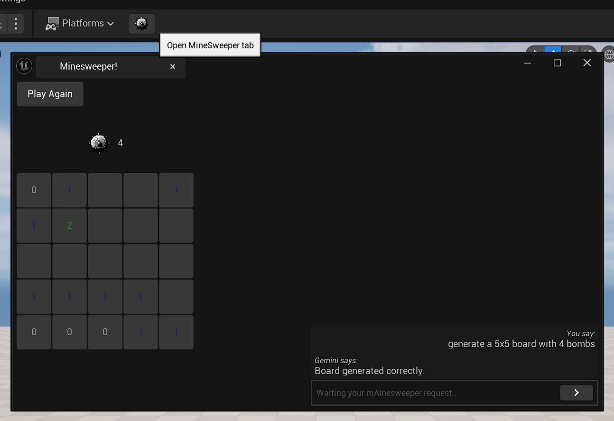

# mAInesweeper Editor

An Unreal Engine plugin that adds a custom tab to play Minesweeper. The game board is generated using AI (Gemini).

# How to Run

1. **Download the project**
2. Double-click on **mAInesweeper.uproject**
3. Setup AI API Key:
   - Go to **Project Settings** > **AI API Settings**
   - Enter a valid **Gemini API key**
4. **Play :)**

# Features

- **Toolbar Integration**: Adds a button to the Level Editor Toolbar to open the Minesweeper Tab
- **Minesweeper Tab** includes:
  - A **"Play Again"** button
  - **Match statistics** (number of bombs generated)
  - An interactive board with **clickable tiles**
  - A **chat-like prompt** for interacting with Gemini AI, specialized in generating Minesweeper boards
- Look out for "[Minesweeper]" logs for assistance :)